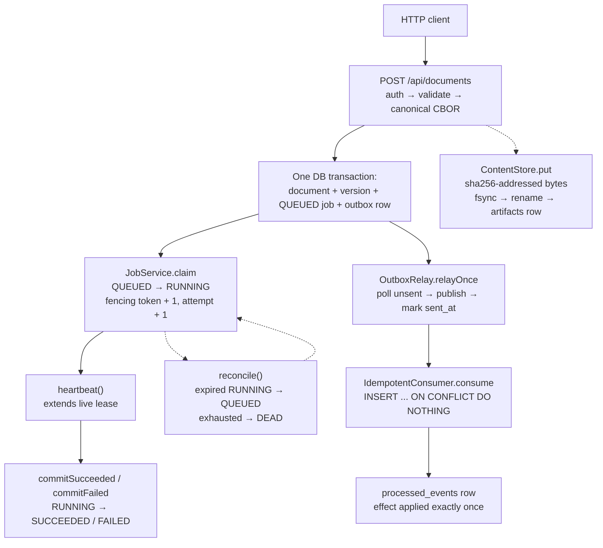
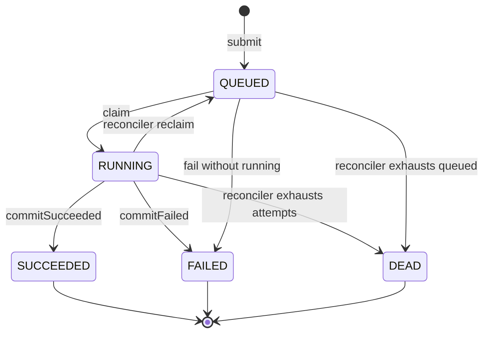

# Architecture

Current implemented system: capability-secure, deterministically replayable execution fabric, single-tenant slice (`t_single`).

Stack: Java 25 (Temurin LTS), Spring Boot 4.1.1, Spring Web (MVC), JDBC, Validation, Flyway, PostgreSQL driver. Tests use Testcontainers `postgres:18` (see `src/test/java/com/g1do/anvil/TestcontainersConfiguration.java`). Local run uses Boot Dev Services; `src/main/resources/application.yaml` sets only the app name.

## Data flow

`POST /api/documents` → `X-Tenant-Id` auth → validate → canonical CBOR → one DB transaction (document + version + job + outbox) → `JobService` claim/heartbeat/commit/reconciler → `OutboxRelay` publish + `sent_at` mark → `IdempotentConsumer`. Bytes go through `ContentStore` (filesystem + `artifacts` rows).

The diagram shows how one submit fans out into the claim path and the relay path; dashed edges are background recovery and side paths.

## Submit

- Routes: `POST /api/documents` (aliases `/api/v1/documents`, `/documents`). Headers `X-Tenant-Id`, `Idempotency-Key`. Body `{"title","mime_type","body"}` where `body` is a JSON string treated as UTF-8 bytes for CBOR `bstr`. See `src/main/java/com/g1do/anvil/submit/SubmitController.java` and `src/main/java/com/g1do/anvil/submit/SubmitService.java`.
- Valid request returns `202` with `{"doc_id","version_id","job_id"}` on first and duplicate delivery; same `(tenant_id, idempotency_key)` returns the same IDs with exactly one job row (DB `UNIQUE(tenant_id, idempotency_key)`, fast-path re-read plus `DuplicateKeyException` replay of the winner).
- One DB transaction writes document, `document_versions` (version 1), `jobs` (`QUEUED`), and `outbox` (`job.committed`); validation or persistence failure leaves none behind.
- Canonical form: RFC 8949 core-deterministic over `{title, mime_type, body}` only (`jackson-dataformat-cbor` with `SORT_PROPERTIES_ALPHABETICALLY`); `version_sha = sha256(canonical_cbor)`. See `src/main/java/com/g1do/anvil/submit/CanonicalCbor.java`.
- Validation limits live in `SubmitService`: title required ≤4096, `mime_type` required ≤255, `Idempotency-Key` required ≤255, `body` must be present; unknown tenant → `401`.

## Jobs: fenced claim, heartbeat, commit, reconciler

See `src/main/java/com/g1do/anvil/jobs/JobService.java`.

- Claim is one atomic statement: candidates `WHERE tenant_id + state='QUEUED' + unheld/expired lease + attempt < max_attempts ORDER BY created_at, id LIMIT 20 FOR UPDATE SKIP LOCKED` (uses `jobs_claim_idx`), then `QUEUED -> RUNNING` with `fencing_token + 1`, `attempt + 1`, `lease = clock_timestamp() + 10s`. The `attempts` ledger row (`UNIQUE(tenant_id, job_id, attempt_number)`) is written in the same transaction: zero lost, zero doubled.
- Heartbeat extends only a live lease held by the same owner and token (`RUNNING` plus `lease_expires_at > clock_timestamp()`).
- `commitSucceeded/Failed` moves `RUNNING -> SUCCEEDED/FAILED` only when id plus owner plus fencing token plus `RUNNING` all match; a stale owner affects zero rows. Terminal rows (`SUCCEEDED/FAILED/DEAD`) are additionally immutable via the `job_state_guard` trigger.
- `reconcile(tenant)` / `reconcileAll()` is the polling reconciler (intended `1s`): expired `RUNNING` with attempts left returns to `QUEUED` (reclaimable with a new token); `QUEUED` or expired `RUNNING` at or beyond `max_attempts` moves to `DEAD` and is never re-offered. Terminals are never claimable.

The diagram shows the legal job lifecycle enforced by the `job_state_guard` trigger; any other transition fails in the database.

- Only the database clock (`clock_timestamp()`) decides leases; worker clocks never do. At-least-once with idempotent fenced effects; exactly-once is not asserted.

## Content store

See `src/main/java/com/g1do/anvil/cas/ContentStore.java`.

- `put(tenant, bytes)` returns `sha256(bytes)` (lowercase hex), stored under `tenants/{tenant}/{sha}` (`anvil.cas.root`, default `var/cas`); no cross-tenant deduplication. `get(tenant, sha)` re-verifies the hash.
- Durability order is mandatory: tmp-write in the destination directory → fsync file → atomic rename → fsync directory, then the `artifacts` row is written. The final name appears only via atomic rename; a hash mismatch is a torn tail and is removed rather than served (`CorruptContentException`).
- `acquire` / `release` drive `artifacts.refcount`. `collectGarbage()` deletes only `refcount = 0` rows older than `GC_grace=1h` (DB clock), re-checking each row `FOR UPDATE` so a newly referenced SHA is retained, then sweeps crash orphans (files without rows, old tmp files) by file mtime. Any ambiguity retains rather than deletes.

## Outbox relay and consumer

See `src/main/java/com/g1do/anvil/outbox/OutboxRelay.java` and `src/main/java/com/g1do/anvil/outbox/IdempotentConsumer.java`.

- `relayOnce(publisher)` polls `WHERE sent_at IS NULL ORDER BY id LIMIT 100 FOR UPDATE SKIP LOCKED` (uses `outbox_poll_idx`), publishes each event with its stable identity (`outbox.id` as `event_id` in payload plus `event_id` header: `{event_id, tenant_id, job_id, doc_id, version_id, type:"job.committed", sha256}`), then marks `UPDATE outbox SET sent_at ... WHERE sent_at IS NULL` in a separate transaction after publish. A publish throw skips the mark, so a crash between publish and mark re-publishes the same identity rather than losing it; exactly-once delivery is not asserted.
- `consume(event)` runs `INSERT INTO processed_events ON CONFLICT DO NOTHING` in one transaction and applies the effect only when the insert wins. Idempotency lives in the database, not in relay memory. Concurrent relays may both publish the same row when polls interleave, but the second mark is a no-op and the consumer still applies once. Progress is durable `sent_at`.

## Database

`src/main/resources/db/migration/V1__durable_v1_schema.sql` defines the single-tenant slice: `tenants, documents, document_versions, jobs, attempts, artifacts, outbox, processed_events`, plus the `job_state_guard` trigger, `jobs_claim_idx` / `jobs_running_lookup_idx` / `jobs_lease_expiry_idx` / `outbox_poll_idx`, and the `active_jobs` / `claimable_jobs` / `unclaimed_outbox` views. Tenant isolation is composite `FOREIGN KEY(tenant_id, xxx_id)` edges; there is no RLS. The migration header documents assumptions, legal transitions, and canonical claim/relay queries.

## Verification proofs

`./mvnw test` boots the full context against containerized Postgres. The test classes prove:

- `DurableV1SchemaTest`: tables, legal-transition guard (terminals immutable), claim/relay indexes used (no `Seq Scan`).
- `SubmitIdempotencyTest`: duplicate `(tenant, key)` returns the same IDs with one job row; validation/persistence failure leaves nothing behind.
- `JobServiceTest`: fencing (stale owner affects zero rows), heartbeat/commit guards, reconciler (`QUEUED` reclaim vs `DEAD`), attempts ledger exactly once, gate-scale contention (naive select-then-update double-claims ≥1/500; atomic CTE zero double-claims/2000 with ledger exact and terminals never offered), zombie resume with real suspend past TTL (resumed worker's heartbeat/commit affect zero rows).
- `ContentStoreTest`: crash-safe put/get (tmp-write, atomic rename, torn-tail removal), refcount GC (referenced SHAs retained, old orphans reclaimed, young retained), real-kill proofs during tmp-write, rename-before-row, and GC file-before-row with hash-verified reads and zero torn bytes.
- `OutboxRelayTest`: ghost redelivery (kill between publish and mark re-publishes the same `event_id` with one `processed_events` row), dedup (`ON CONFLICT DO NOTHING`), concurrent relays apply once.

## Timings and limits

`lease_ttl=10s, heartbeat_every=3s, claim LIMIT 20, max_attempts=5, reconciler_poll=1s, relay LIMIT 100, GC_grace=1h`. `clock_timestamp()` is the only lease clock. Polling first; no broker, Redis, or external queue.
